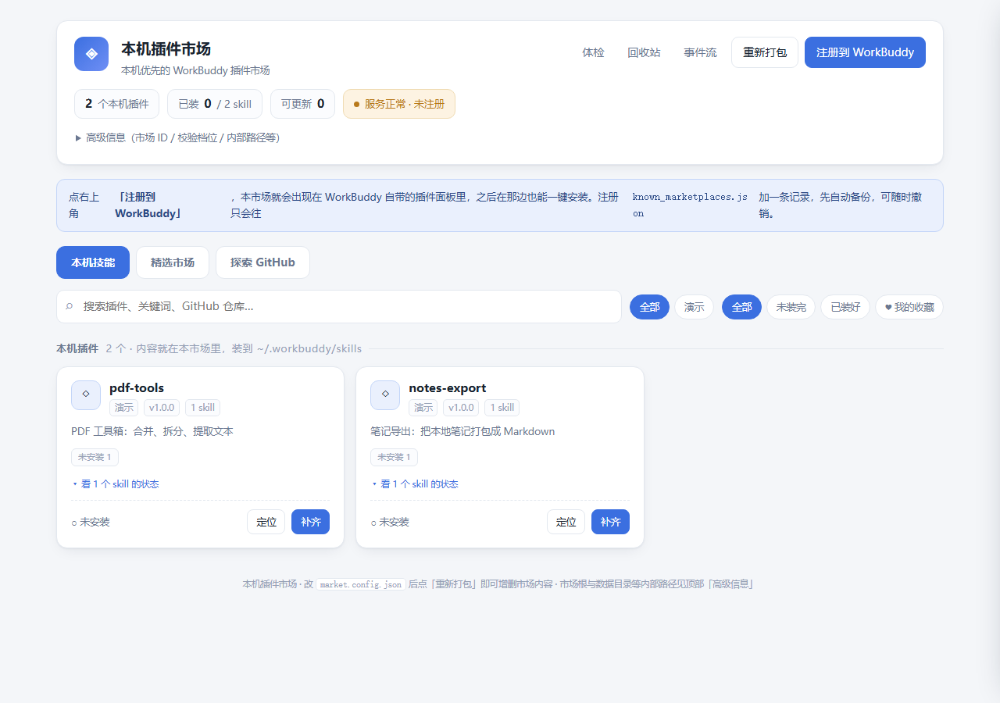
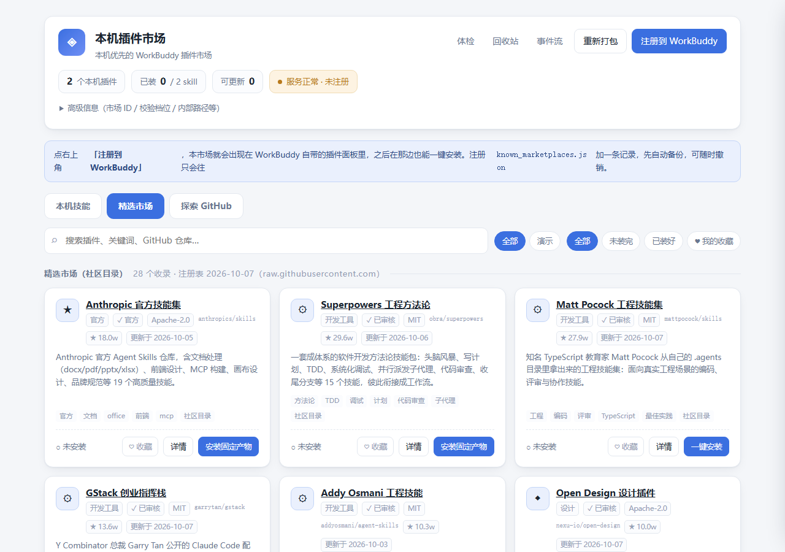
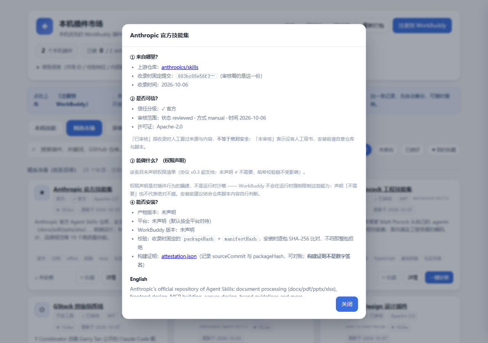

# WorkBuddy 本机插件市场

参考 **DSH（DeepSeek Harness）的插件市场**做法，给 WorkBuddy 搭的一个**本机插件市场**：  
把你自己机器上的 skill 打包成标准插件，再注册进 WorkBuddy 自带的插件面板；  
同时附一个网页界面，用来浏览、搜索、一键装。

一句话：**双击 `一键启动.cmd` 就完事。**

> **定位：A local-first, secure and reproducible plugin marketplace for WorkBuddy.**  
> 一个本机优先、安全可验证、可复现安装的 WorkBuddy 插件市场。核心卖点：
> **Local-first**（内容与状态全在本机）/ **Privacy-first**（本机 skill 不上传、
> 配置不入库）/ **Reproducible**（收录固定 sourceCommit、安装按 packageHash
> 逐包校验）/ **Recoverable**（事务日志 + 崩溃恢复 + 回收站回滚）/
> **Self-hostable**（离线兜底，私有注册表路线已留好）。

四层架构（内核与产品分离，实现全部在 `src/workbuddy_market/`）：

| 层 | 载体 | 管什么 |
|---|---|---|
| Core | `src/workbuddy_market/`（installer / transactions / ownership / trash / artifact / packaging …） | 安装事务、安全卸载、崩溃恢复、哈希校验 |
| Protocol | [docs/plugin-spec.md](docs/plugin-spec.md)（Market Package v0.3） | manifest schema、permissions、兼容性、attestation |
| Registry | `registry/plugins.json` + 每日 CI | 精选收录、产物回写、信任分级 |
| Clients | 网页界面 / `launcher.py` / `workbuddy-market` CLI（含 `verify`） | 浏览、安装、体检、对账 |

> **兼容层说明**：根目录 `market_core.py` 自 v2.19 起只是兼容 shim
> （re-export + 注入点留驻，<400 行有自检盯防），新代码请
> `import workbuddy_market.*`；`market_server.py` / `launcher.py` 是
> 用户入口与既有编排，按 v3 路线逐步收进包内。

> **新手疑问先看 [docs/FAQ.md](docs/FAQ.md)**：社区注册表的内容怎么来的、
> 和 anthropics/skills 这类官方仓库是什么关系（商品 vs 货架）、
> 「报菜名」式的收录与安装怎么玩、数据多久更新、装错了怎么恢复。

> **本仓库不含 `plugins/`（打包产物），也不含任何人的市场配置**：市场内容是你本机 skill 的副本，属于个人数据，  
> 不随仓库分发；`market.config.json`（含你自己的 skill 组合）同样不入库，仓库只提供模板  
> `market.config.example.json`。运行状态、日志、所有权记录、回收站同样只留在本机。  
> **v2.22 起不需要手工复制配置**：首次启动检测到配置缺失会从模板自动初始化
> （绝不覆盖已有配置，损坏的原样保留并给出修复建议）；想把哪些 skill 收进市场，
> 编辑 `market.config.json` 的 `localPlugins` 后点「重新打包」即可，见[第四节](#四怎么改市场里的内容)。

---

## 快速上手（Quick Start）

> 三十秒版本：**克隆仓库 → 双击 `一键启动.cmd` → 直接回车**。
> 从 v2.22 起不需要手工建配置文件。

1. **获取并启动**：`git clone` 后双击 `一键启动.cmd`（或 `python launcher.py`）。
   首次启动向导会做环境预检（Python / 目录 / 配置 / skills / 端口），每项
   给出 成功 / 警告 / 失败 三态结果；
2. **首次配置自动初始化**：检测到没有 `market.config.json` 时，自动从模板
   创建（并发安全、绝不覆盖已有配置；损坏的文件原样保留并给出修复建议）；
3. **只浏览 / 注册**：首次创建配置后终端会问一次 —— **回车 = 只浏览市场**
   （默认，不改动 WorkBuddy 的任何配置）；输入 `2` = 注册进 WorkBuddy 插件面板
   （仍要过打包 / 自检前置检查）。之后随时可在网页点「注册到 WorkBuddy」；
4. **搜索、看详情、安装**：顶部三个入口 —— **本机技能**（管理自己打包的
   Skills）/ **精选市场**（收录审核过的社区插件）/ **探索 GitHub**（未审核
   来源明确标注）。安装前点「详情」看四问：来自哪里 / 是否可信 / 能做什么 /
   能否安装；
5. **检查、更新、卸载、恢复**：卡片上的「补齐 / 更新 / 卸载…」都有分级预览
   与确认；卸载移进回收站可恢复；顶部「更新中心」聚合所有可更新项；
6. **出错用诊断**：失败会给出 人话原因 + 已完成/未影响范围 + 下一步操作
   （可重试 / 看日志 / 复制诊断）；顶栏「体检」跑只读体检并导出脱敏报告；
   命令行等价物是 `workbuddy-market doctor`。







> 截图由 `scripts/capture-screenshots.py` 在隔离区用**合成数据**从真实运行的
> 界面采集（不含任何真实用户的 skill 内容、路径或口令）；界面持续演进，
> 以你本机实际页面为准。

### 平台支持矩阵

如实区分「CI 覆盖」「实际验证」「尚未验证」—— **通过 Python 测试 ≠
WorkBuddy 宿主集成已验证**：

| 平台 | CI 覆盖 | 实际验证 | 说明 |
|---|---|---|---|
| Windows 10/11 | 语法/隐私/契约 + **selftest 硬门槛** + wheel 构建 + 浏览器冒烟（本地） | ✅ 日常使用环境；WorkBuddy 5.7.6 面板实测（见 docs/WorkBuddy-5.7.6-面板实测.md） | 主战场，最可靠 |
| Linux (Ubuntu) | 语法/隐私/契约 + POSIX 语义冒烟 + pytest + wheel 构建 + **ui-smoke 浏览器门禁** | ⚠️ 仅 CI runner 实测 | 未在真实 WorkBuddy 宿主集成验证 |
| macOS | 语法/隐私/契约 + POSIX 语义冒烟 + pytest（v2.18 起槽位） | ❌ 未验证 | 真实 fcntl/symlink 语义从未人工跑过 |

### 参与

提 Issue / PR 前先看 [CONTRIBUTING.md](CONTRIBUTING.md)（含提交内容隐私纪律
与测试要求）；协议与收录标准见 [docs/plugin-spec.md](docs/plugin-spec.md)。

---

## 一、怎么用（傻瓜模式）

| 我想…                       | 双击这个                     |
| ------------------------- | ------------------------ |
| 正常使用                      | **`一键启动.cmd`** ← 平时只用这一个 |
| 只想看网页界面，不想动 WorkBuddy 的配置 | `安全模式-只开网页.cmd`          |
| 不想要这个市场了，从 WorkBuddy 里摘掉  | `撤销注册.cmd`               |

`一键启动.cmd` 会依次做五件事，屏幕上都有中文提示：

```
[0/4] 首次启动检查（v2.22：配置缺失自动从模板初始化，绝不覆盖已有配置）
[1/4] 打包本机 skill → 插件（增量同步）
[2/4] 自检
[3/4] 注册到 WorkBuddy 插件面板
[4/4] 打开市场界面
```

首次启动（配置刚被初始化）时，交互式终端会问一次启动方式：
**回车 = 只浏览市场**（默认，不改动 WorkBuddy 配置）；输入 2 = 注册。
非交互环境不等待输入，直接纯浏览模式。无论怎么选，真正的注册都仍要过
打包 / 自检前置检查。不想跑向导加 `--no-wizard`。

跑完会自动用浏览器打开一个本地网页（地址形如 `http://127.0.0.1:8777/`），  
**这个命令行窗口不能关**，关了网页服务就停了。按 `Ctrl+C` 或直接关窗口即可停止。

---

## 二、两种安装方式

### 方式 A：装进 WorkBuddy 的技能列表（原生形态）

`一键启动.cmd` 已经帮你注册好了——往 `~/.workbuddy/plugins/known_marketplaces.json`
加一条记录，写前自动备份，`撤销注册.cmd` 可随时摘掉。

装好后，skill 出现在 WorkBuddy 的 **「专家 技能·连接器」→ 技能页 → 「用户自定义」**
一栏，每张卡片带开关，和官方装来的 skill 一样用。

> **5.7.6 实测**：面板里**没有**「市场来源」下拉框，自定义市场不会以
> 「本机插件市场」板块单独露出——市场是幕后角色，技能页能看到它装的 skill
> 就说明它工作了。安装 / 卸载 / 更新走方式 B 的网页界面。
> 实测细节见 `docs/WorkBuddy-5.7.6-面板实测.md`。

### 方式 B：走网页界面

网页里有卡片，直接点按钮：

- **本机插件**卡片：
  - **「补齐」** —— 只把缺的 skill 复制到 `~/.workbuddy/skills/`，已有的不碰
  - **「更新」** —— 只有当「本市场装过、但之后被改过」的 skill 存在时才出现，  
    会把旧的先移进回收站再放新的（可回滚）
  - **「卸载…」** —— 先弹一个**分级预览**，告诉你哪些会移走、哪些会被保留，  
    确认后才动
- **社区目录**卡片 —— 「详情」看截图 / 权限 / 兼容性 / 不可变产物，
  ♥ 收藏（本机持久化）、「一键安装」（走不可变 artifact 或 ghpm）
- **GitHub 收录源**卡片 —— 点「一键安装」调用 `ghpm` 联网下载，  
  下方有实时进度条和 ghpm 的输出，装完自动刷新

顶部还有 **「更新中心」**（聚合所有有更新的插件）、**「回收站」**
（可一键清空）、**「我的收藏」**（筛选芯片）。

---

## 三、卸载为什么是安全的

这是 v2 最要紧的一处修改。**市场上架的 skill 和「本市场装过的 skill」是两回事**，  
只有后者才允许被卸载。

安装成功时，本市场会在 `.ownership.json` 里记下：

```json
{ "my-skill": { "owner": "wb-local-market", "plugin": "my-first-plugin",
             "version": "1.0.0", "installedAt": "...", "hash": "<内容指纹>" } }
```

卸载时按指纹分成三档：

| 分档      | 含义                  | 卸载时               |
| ------- | ------------------- | ----------------- |
| ✅ 可安全卸载 | 本市场装的，且内容没被动过       | 移入 `.trash/`，可恢复  |
| ⚠️ 被改过  | 本市场装的，但之后你改过        | **默认保留**，避免吞掉你的改动 |
| ⚠️ 非本市场 | 从别的途径装的（比如 ghpm 装的） | **永不触碰**          |

> 新机器上第一次用，点卸载什么都不会发生 —— 这是刻意的。  
> 只有「本市场装过」的 skill 才归它托管：把某个 skill 删掉、再从市场装回来，  
> 它才归本市场托管，那时卸载才会生效。

---

## 四、怎么改市场里的内容

只改一个文件：**`market.config.json`**（本机私有，已 gitignore）。克隆后先从模板复制一份，  
否则启动会明确报「market.config.json 不存在」：

```bash
cp market.config.example.json market.config.json
```

改完点界面上的「重新打包」，  
或重新双击 `一键启动.cmd`。

```jsonc
{
  "localPlugins": [
    {
      "name": "my-first-plugin",          // 插件 ID（也是目录名）
      "displayName": "我的第一个插件",      // 卡片标题
      "category": "工具",                  // 分类，界面按此筛选
      "version": "1.0.0",
      "description": "……",               // 卡片描述
      "keywords": ["示例"],
      "skills": ["my-skill", "……"]              // ← 要打包哪些本机 skill（按目录名）
    }
  ],
  "remoteSources": [
    {
      "repo": "anthropics/skills",        // GitHub 仓库 owner/repo
      "displayName": "Anthropic 官方技能集",
      "category": "官方",
      "description": "……",
      "skillCount": 19
    }
  ]
}
```

- **加一个本机插件**：往 `localPlugins` 里加一条，`skills` 填  
  `~/.workbuddy/skills/` 下的目录名。
- **加一个 GitHub 源**：往 `remoteSources` 里加一条，填 `owner/repo` 即可。
- **删掉插件**：从配置里删掉那一整块，重新打包。被删掉的插件目录会**rename 进  
  `.trash/`**，不会真删。

> 模板里的 `localPlugins` / `remoteSources` 默认为空：你装了什么、收录了什么，只存在于本机那份 `market.config.json` 里，不进 Git。

---

## 五、目录结构

```
workbuddy-market/
├── 一键启动.cmd                      ← 主入口，双击
├── 安全模式-只开网页.cmd              ← 不碰 WorkBuddy 配置
├── 撤销注册.cmd                      ← 从 WorkBuddy 摘掉本市场
├── _run.cmd                          ← 公共引导（找 Python），纯 ASCII
├── launcher.py                       ← 命令行入口与编排
├── market_core.py                    ← 内核：打包 / 注册 / 状态 / 安装（兼容入口，
│                                        实现自 v2.8 起陆续迁入 src/）
├── src/workbuddy_market/             ← 内核包（v2.8/R2 起）：paths / errors / fsutil /
│                                        hasher / locking / logging；v2.9/R3 增
│                                        config / scanner / sync / version；
│                                        v2.10 增 catalog，v2.11 增 registry，
│                                        v2.12/R4 增 trash / ownership / transactions，
│                                        v2.13 增 doctor（clone 外可跑的体检），
│                                        v2.14/R5 增 installer / uninstaller，
│                                        v2.15 增 packaging（Market Package
│                                        pack / verify，协议见 docs/plugin-spec.md），
│                                        v2.16 增 artifact（不可变产物下载 /
│                                        解包 / 校验 → 事务安装），
│                                        v2.17 增 adapters/（WorkBuddy 宿主
│                                        适配层，register 迁出）
├── registry/plugins.json             ← 社区注册表（v2.11）：静态收录人工维护，
│                                        动态字段（stars 等）由每日 CI 重建；
│                                        v2.12 增 trust / sourceCommit / license /
│                                        review（供应链固定来源）
├── .github/workflows/                ← ci.yml（语法/隐私/自检）+
│                                        registry.yml（注册表每日重建）
├── scripts/build_registry.py         ← 注册表每日重建脚本（CI 与本机共用）
├── market_server.py                  ← 本地网页服务（只监听 127.0.0.1，带口令鉴权）
├── selftest.py                       ← 776 项自检（默认隔离模式，不碰真实环境）
├── market.config.example.json        ← ★ 配置模板（入库），先复制成下面那份再改
├── market.config.json                ← 唯一数据源（本机私有，已 gitignore）
├── .codebuddy-plugin/marketplace.json ← 市场索引（自动生成，WorkBuddy 读它）
├── plugins/                          ← 插件内容（自动生成，随你的配置而定）
│   └── <你的插件>/{.codebuddy-plugin/plugin.json, skills/…}
├── web/                              ← 网页界面（服务端只向 index.html 注入口令）
│   ├── index.html                    ← 页面骨架（token 注入点只有这里的 meta）
│   ├── style.css
│   └── app/                          ← 前端 ES Modules（v2.22 拆分，零构建零依赖：
│                                        main.js 入口，api/state/plugins/install/
│                                        update/details/trust/registry/… 各司其职）
├── .ownership.json                   ← 谁装的、装时是什么内容 + 快速指纹（卸载靠它分级）
├── .market-tx/                       ← 安装/卸载的事务日志（正常结束即清空；残留会被自动补账）
├── .market.lock                      ← 跨进程写锁（Windows msvcrt / POSIX fcntl）
├── .market-log.lock                  ← 日志专用锁（只管轮转 + 追加）
├── .market-log.ndjson                ← 事件流，一行一条 JSON（超 10MB 自动轮转）
├── .market-state.json                ← 上次同步的统计
├── .backups/                         ← known_marketplaces.json 的备份（留最近 20 份）
└── .trash/                           ← 回收站（卸载 / 覆盖 / 退役的目录都在这）
    └── .index.json                   ← 各项体积记账，避免每次都重新扫一遍
```

---

## 六、命令行也行

```bash
python launcher.py --help         # 全部参数（argparse，冲突会明确报错）
python launcher.py                # 一键全流程（等价于双击）
python launcher.py --sync         # 只重新打包
python launcher.py --register     # 只注册
python launcher.py --unregister   # 撤销注册
python launcher.py --recover      # 只做事务恢复（补记上次没记完的所有权）
python launcher.py --recover --discard-conflicts  # 放弃那些「内容已被改过」的补账
python launcher.py --purge-trash  # 清空回收站
python launcher.py --status       # 状态 + 深度自检 + 回收站
python launcher.py --status --json    # 机器可读（CI / Harness 用）
python launcher.py --sync --quiet     # 只输出结果，不打印过程
python launcher.py --force-register # 打包/自检失败也照样注册（不推荐）
python launcher.py --no-register  # 只开网页，不碰 WorkBuddy 配置
python launcher.py --serve --no-open --port 8899   # 换端口、不开浏览器

python selftest.py                # 776 项自检，隔离模式（临时目录里跑完整流程）
python selftest.py --real         # 只读检查现网状态，不写任何东西

python -m workbuddy_market doctor   # 体检（唯一不依赖 clone 布局的子命令）
workbuddy-market doctor             # pipx 安装后同样可用；--fix 做事务恢复
workbuddy-market verify <zip|dir>   # 校验 Market Package + 风险预览/兼容性报告
workbuddy-market list               # 浏览社区目录（注册表）；--category 筛选
workbuddy-market search <kw>        # 按关键词搜索社区目录；--json 输出
```

> **注意**：`一键启动.cmd` 在「打包」或「自检」失败时会**跳过注册**，但仍然打开网页。
> 注册会写 WorkBuddy 的配置文件，属于有外部副作用的步骤 —— 前置检查没过就不该动它，
> 否则 WorkBuddy 会看到一个「根本没更新成功的旧市场」，而你还以为启动成功了。
> 确实想强行注册就加 `--force-register`。

`selftest.py` 默认**在临时目录里**造 3 个假 skill，完整走一遍  
「打包 → 安装 → 更新 → 卸载 → 回滚 → 加锁 → 日志轮转 → 回收站清理」，  
**不碰真实的 `~/.workbuddy`，也不动真实的市场目录**。它覆盖了：

- 市场索引是否符合 WorkBuddy 原生 schema、`source` 目录与 `plugin.json` 是否齐全
- 打包排除、增量同步（增/删文件各只动 1 个）
- **同秒内 + 同大小的改动能被检出**（v1 的真实 bug）
- 安装三种模式、所有权记录、快速指纹快路径
- **卸载分级**：可安全卸载 / 被改过 / 非本市场，以及「用户自己的 skill 毫发无损」
- 文件锁的互斥与可重入、日志真 tail 与轮转、回收站按天数/容量清理
- 坏配置抛 `ConfigError` 而不是静默当成「配置不存在」
- 深度自检能否检出「版本不一致」「配置声明但未打包」
- 注册/撤销只动自己那一条、同一秒两次备份都留下

**第 16 节是故障注入**（v2.1 新增），专门验证「出错时数据还在」：

| 场景                             | 必须的结果                                        |
| ------------------------------ | -------------------------------------------- |
| 安装复制中途失败                       | 本机旧版本**内容与文件清单一字未改**，不留暂存目录                  |
| `known_marketplaces.json` 损坏   | register / unregister **拒绝写入**，坏文件原样保留       |
| 配置里写 `../escape`、`NUL`、`a/b` 等 | 15 种非法 id **全部拒绝**；越界 skill、插件重名、repo 格式错也拒绝 |
| 技能目录里放 junction / 软链指向外部       | **不被跟随**，外部文件名在市场里搜不到                        |
| `strict` 档位                    | 时间戳一样但内容不同 → **能检出**（fast 档位漏检，已作对照）         |

**第 17 / 18 节是第三轮评审新增的「构造对抗」用例**（v2.2）：

| 场景                                             | 必须的结果                                              |
| ---------------------------------------------- | -------------------------------------------------- |
| 改一个旧文件，**大小 / mtime / 最大值三者都没变**             | 指纹抓不到 → 但 install / uninstall **读内容后仍判 modified** |
| 连 mtime 都压回原值（指纹被完全伪造）                        | `update` **照样覆盖**（v2.1 会静默跳过）                      |
| 回收站索引里写 `../../外部目录`                           | `prune_trash` **不碰** `.trash` 外的任何东西                |
| 配置里同时写 `Story` 与 `story`                        | 全平台 `ConfigError`（Windows 上它们是同一个目录）               |
| 计划删 2 个、其中 1 个删失败                               | `removed=1 failed=1`，`freed` 只算 100 而不是 200          |
| `.index.json` 写入失败                           | 搬移**如实生效并成功返回**，下次状态刷新自动补录自愈                       |
| 市场产物里塞一个 junction                              | 安装**直接拒绝该 skill**，外部内容不进 `~/.workbuddy/skills`      |

**第 19 节是第四轮评审新增的「事务边界 + 本地 API」用例**（v2.3）：

| 场景                                   | 必须的结果                                          |
| ------------------------------------ | ---------------------------------------------- |
| 打包失败时跑 launcher                      | **不调用 `register`**，但网页照常启动；并如实告知跳过原因            |
| 全新安装成功、写 `.ownership.json` 失败        | 文件在盘上 + **留下事务日志**，安装仍报成功但给出告警；恢复后 skill 回到 `safe` |
| 更新成功、写所有权失败                         | 磁盘已换新，日志保留；恢复后所有权 hash 跟上新内容                    |
| 暂存阶段崩掉（日志残留）                         | 只清账、**不补记**、不动所有权                              |
| `register` 过程中 WorkBuddy 改了同一个文件     | 基于最新内容**重试合并**，中途写进来的条目没被覆盖                     |
| 配置写 `maxSizeBytes: 1.9` / `NaN` / `Infinity` | 一律 `ConfigError`（不再被 `int()` 静默截断）           |
| 没有口令 / 口令错 / `Origin: http://evil.example` | `GET`·`POST /api/*` 全部 **403**                 |
| 带正确口令 + 同端口 Origin                   | 正常放行 200                                       |
| `POST` 3 MiB 请求体                     | **413**（且不整段读进内存）                              |
| `POST` 坏 JSON                         | **400** 并说明是 JSON 解析问题                          |
| `/api/open/path` 传市场外路径 / `C:\Windows` | **400**，不弹资源管理器                               |
| `/api/open/path` 传 `target=plugin, id=../escape` | **400**                                    |
| job 表超过上限 / 已完成任务超时                   | 淘汰已完成的最老的；**运行中的一个都不动**                        |
| `/api/job/<id>/cancel`               | **真的杀掉子进程**（`poll()` 不再为 None）                |
| 1 秒内连续请求 `/api/state`                | 只重建一次（缓存）；有写操作则立即失效                            |


**第 20 节是第五轮评审新增的「事务闭环」用例**（v2.4）：

| 场景                                          | 必须的结果                                        |
| ------------------------------------------- | -------------------------------------------- |
| 事务日志都开不出来                                    | 安装**直接失败**，磁盘一个字节都不动                        |
| 崩在「`os.replace` 成功」与「交付确认」之间                | 凭证**已经存在**（v2.3 是 0 份），恢复据此认领                |
| 日志里带着 `expected hash` + `state`              | 恢复时靠它逐条比对，而不是看「目录在不在」                        |
| 崩溃之后、恢复之前用户改了文件                             | **拒绝认领**并报 conflict，保留日志；同事务里没被改的 skill 照常认领   |
| 同上，且跑了 `--discard-conflicts`                | 才放弃这笔账，**依然不认领**                             |
| 卸载时 `forget_owner()` 失败                     | 生成 `uninstall` 类型日志，恢复后补清所有权                  |
| 3 份日志共 22.9 MB，取最后 60 条                     | 只读 **32 KB / 1 ms**（v2.3 是读满 28.6 MB / 1378 ms） |
| `/api/remote/add` 传 `../../x` / `foo` / `-x/y` | **400**（复用内核的 `validate_repo`）                |
| 8 个并发请求同时撞上过期的状态缓存                          | `build_state` 只跑 **1 次**（single-flight）      |
| 目录形态的重解析点                                   | `_drop_link` **真的摘掉**它，目标目录毫发无损                |

**第 21 节是第六轮评审新增的「并发 / 扫描失败 / 崩溃点矩阵」用例**（v2.5）：

| 场景                              | 必须的结果                                       |
| ------------------------------- | ------------------------------------------- |
| 32 并发打 `/api/state`              | 无死锁、无异常；`build_state` **只重建 1 次**           |
| 8 并发 `install` / 8 并发 `register` | 无异常、无丢失更新、无重复事务                             |
| 10 个后台任务请求同时打进来                 | 只接受 `MAX_RUNNING_JOBS` 个，其余 **429**；令牌不泄漏    |
| 源端目录读不了                         | `sync` **直接失败**，市场内容**一个文件都不删**             |
| 安装源读不了                          | 该 skill 安装失败，本机版本**一个字节没动**                  |
| 本机 skill 读不了                    | 卸载判定保守当成 `modified` → **不搬走**                |
| 5 个崩溃点（tx_begin → record_owner 之间） | 恢复后 **disk ↔ ownership 一致、无残留暂存、日志收敛**    |

**第 22 节是第七轮评审新增的「ghpm 事件解析 / 取消竞态 / 进程树」用例**（v2.6）：

| 场景                                        | 必须的结果                                      |
| ----------------------------------------- | ------------------------------------------ |
| ghpm 发 `done/ok=false` 且**没有 error 字段**     | 不抛 NameError，任务行有兜底文案，**不会卡在 running**      |
| 同上但带 `error` 字段                           | 优先展示 error 原文                               |
| 取消发生在 `Popen` 之前                          | 直接返回 False，**不启动子进程**                       |
| 取消发生在运行中                                  | 子进程（连同它的树）被终止，任务收尾为失败                       |
| `MAX+6` 个请求**同时**打进来（barrier 真并发）          | 只接受 `MAX_RUNNING_JOBS` 个；满载计数 == 上限；结束后**槽位归零** |
| 全部用例结束                                    | `running_jobs() == 0`（并发槽不泄漏）、无卡死任务         |

> 隔离靠两个环境变量：`GHPM_MARKET_ROOT`（市场根目录）与 `GHPM_HOME`（WorkBuddy 家目录）。
> 少数用例依赖环境能力（比如能不能造出重解析点），造不出来时会打印 `SKIP` 并说明原因 ——
> **跳过不等于通过**，汇总行里会单独计数。

---

## 七、安全边界

这个工具会碰的文件就这几个，全都有备份或回收站兜底：

| 文件/目录                                          | 操作                         | 兜底                                              |
| ---------------------------------------------- | -------------------------- | ----------------------------------------------- |
| `~/.workbuddy/plugins/known_marketplaces.json` | 加/删**一条**记录，其余原样保留         | 全程持文件锁；**乐观合并**（写前重读比对，被别人改过就重试）；改前自动备份（纳秒戳）；写回后校验；`撤销注册.cmd` |
| `~/.workbuddy/skills/<name>/`                  | 安装只补缺 / 按需更新；卸载**只动本市场装的** | 全部走 `.trash/`，可手工拖回；装/卸全程有事务日志，崩了能补账                   |
| 本市场目录                                          | 打包产物，可随时重建                 | 退役目录也是 rename 进 `.trash/`                       |

> **关于 `known_marketplaces.json` 被改动**：WorkBuddy 自己在运行时也会改写这个文件  
> ——它会给 `autoUpdate` 的 zip 市场刷新 `lastUpdated`，并把 zip 地址换成带内容哈希的版本。  
> 所以如果你对比备份，看到那几个官方市场的时间戳变了，**那是 WorkBuddy 干的，不是本工具**。  
> 本工具严格「读最新 → 只动自己那一条 → 重读确认没被插手 → 原子写回 → 读回校验」，
> 不会覆盖别人的条目；万一撞车会自动基于最新内容重试。

- 网页服务**只监听 `127.0.0.1`**，不对外暴露。但 **localhost ≠ 只有你的页面能调用**：
  任何本机浏览器里打开的网页都能往这个端口发请求。所以从 v2.3 起：
  - 启动时生成一次性口令，注入到页面里；所有 `/api/*` 都要带 `X-Local-Market-Token`，否则 **403**
  - 带 `Origin` 的请求必须是本机同端口，否则 **403**（挡住跨源 CSRF）
  - 口令只存在于「服务端返回的那张页面」里；第三方网页读不到它 —— 跨源读响应被浏览器挡住
  - `/api/open/path` **只认白名单**：市场根、`plugins/`、`web/`、`.trash/`，以及指定 id 的插件目录。
    不再接受任意本机路径（v2.2 连 `C:\Windows` 都能开）
  - 请求体上限 1 MiB（超出 **413**），坏 JSON 明确回 **400**，不再静默变成 `{}`
- 所有写操作（打包 / 注册 / 安装 / 卸载）都在一把**跨进程文件锁**下串行，  
  不会出现两个进程互相覆盖（lost update）。
- 删除一律走「移入回收站」。**唯一会真删的地方是 `.trash/` 内部**，  
  而且只在超过 `market.config.json` 里的 `trash` 阈值时才动：  
  默认超过 30 天、或总量超过 2 GB 才清理。
- 日志超过 10 MB 自动轮转成 `.1` / `.2`，最多留两份，不会无限长。
- 打包会排除 `*.bak`、`__pycache__`、`.git`、`node_modules`、`*.pyc` 等  
  （见 `market.config.json` 的 `packaging` 段）。

---

## 八、参考了 DSH 的哪些做法

| DSH 的做法          | 这里怎么落地                                                           |
| ---------------- | ---------------------------------------------------------------- |
| 市场本身是一个可装卸的插件，自举 | 本市场是个标准的 `type: "directory"` 市场，可注册可摘除                           |
| 插件清单与加载配置分离      | `marketplace.json`（索引）+ `plugin.json`（插件清单）+ `skills/`（内容）三件套    |
| 状态文件 + 分组 + 分类   | `market.config.json` 的 `category` 驱动界面分类筛选                       |
| 事件流写 ndjson      | `.market-log.ndjson`，每行 `{at, level, event, detail}`，网页「事件流」抽屉可看 |
| 更新失败有回滚记录        | GitHub 源安装/更新走 `ghpm`，它自带事务与回滚；进度条实时显示                           |
| 区域/镜像感知          | 复用 `ghpm` 的镜像回退（`GHPM_MIRRORS`）                                  |
| 操作日志可追溯          | 每次打包/注册/安装都写事件流                                                  |
| 目录数据由 CI 每天刷新（stars 等），市场打开即最新 | v2.10：本地服务的 daemon 线程每 15 分钟检查、按 24h TTL 自动拉 GitHub API，不用任何外部 CI；失败保旧值、下个检查点重试 |
| 精选注册表（plugins.json）承担静态身份，动态数据不进清单 | v2.10：`remoteSources` 只承担静态身份，实时元数据缓存在 STATE_HOME 的 `catalog.json`，永不写回配置 |
| 浏览全目录 + 一键安装     | v2.10：搜索框本地零匹配时自动搜 GitHub 全网，结果卡片直接「一键安装」（仍走 ghpm 的事务/回滚/进度链路）    |
| 精选注册表是一个独立 GitHub 仓库，克隆即用 | v2.11：注册表就是本仓库的 `registry/plugins.json`（每日 CI 重建动态字段）；市场端按 6h TTL 在线拉取，网页新增「社区目录」区块，条目直接一键安装 |

---

## 九、常见问题

**Q：双击窗口一闪就没了？**  
说明 Python 没找到，窗口里会有英文提示（让装 Python 3.10+）。  
引导脚本会依次尝试 `py -3` → `python` → `%USERPROFILE%\.workbuddy\binaries\python\versions\3.13.12\python.exe`。

**Q：注册了但 WorkBuddy 插件面板里看不到？**  
先确认找的地方对不对：**5.7.6 实测**，面板（专家·技能·连接器）没有「市场来源」  
入口，自定义市场不会单独显示。装好的 skill 在 **技能页 → 用户自定义** 一栏。  
还看不到就重启一次 WorkBuddy，并用 `python launcher.py --status` 确认注册  
状态（应显示「已注册」）。安装 / 卸载 / 更新走 `一键启动.cmd` 的网页界面。

**Q：端口被占用？**  
会自动往后找 20 个端口。也可以 `python launcher.py --port 8899`。

**Q：我想把市场挪到别的盘？**  
整个目录搬走，然后重新跑一次 `一键启动.cmd`（会更新注册里的路径）。

**Q：点了卸载，怎么什么都没发生？**  
正常。说明这个插件的 skill **不是本市场装的**（是 ghpm 之类的途径装的），  
本市场不会去动它们。网页上会显示「非本市场 N · 不会动」。  
想验证：先把某个 skill 删掉，再从市场装回来，它才归本市场托管，那时卸载才会生效。  
如果你确实想移除那些 skill，用 `ghpm remove <项目名>` 或直接删目录。

**Q：怎么确认一切正常？**  
`python launcher.py --status`（含深度自检），或网页顶部的徽章。  
装好之后出问题了、或不确定环境对不对，用 `workbuddy-market doctor`
逐项体检（在任何目录都能跑；`--fix` 会补记上次没记完的事务）。

---

## 十、版本历史

| 轮次 | 主题 | 详解 |
|---|---|---|
| v2 → v2.11 | 七轮代码评审 + 开源重构 R1~R3 + GitHub 动态目录 + 社区注册表 | [docs/versions.md](docs/versions.md) |
| v2.12 | 供应链信任（trust 分级 / sourceCommit 固定 / 漂移拦截）+ R4 模块化收尾 + CI 加固 | [CHANGELOG.md](CHANGELOG.md) 2.12.0 条目 |
| v2.13 | 跨卷回收站原子化 + API /api/v1 版本化 + doctor 体检 + v3.0 路线定稿 | [CHANGELOG.md](CHANGELOG.md) 2.13.0 条目 |
| v2.14 | R5：installer / uninstaller 迁包（core 1755 → 1379 行）+ manifest 协议讨论稿 | [CHANGELOG.md](CHANGELOG.md) 2.14.0 条目 |
| v2.15 | Market Package 协议冻结 + pack / verify 实现（packaging.py） | [CHANGELOG.md](CHANGELOG.md) 2.15.0 条目 · [docs/plugin-spec.md](docs/plugin-spec.md) |
| v2.16 | 包接入安装链：不可变 artifact → 哈希校验 → 事务安装（全链闭环） | [CHANGELOG.md](CHANGELOG.md) 2.16.0 条目 |
| **v2.17** | **WorkBuddy Adapter + CI 产物源 + Web 拆文件 + pytest 试点 + wheel/POSIX CI** | [CHANGELOG.md](CHANGELOG.md) 2.17.0 条目 |
| **v2.18** | **快赢包：artifact 版本回退修复 + FAQ 自检数漂移修复 + 隐私历史审计 CI + macOS 冒烟槽位** | [CHANGELOG.md](CHANGELOG.md) 2.18.0 条目 |
| **v2.19** | **R6 收尾：state / application 迁包，market_core 收成 294 行兼容 shim** | [CHANGELOG.md](CHANGELOG.md) 2.19.0 条目 |
| **v2.20** | **供应链安全轮：manifest permissions + 风险预览 + 兼容性检测 + 构建证明 attestation + CLI verify** | [CHANGELOG.md](CHANGELOG.md) 2.20.0 条目 · [docs/plugin-spec.md](docs/plugin-spec.md) v0.3 |
| **v2.21** | **产品化轮：收藏 + 截图 + 更新中心 + CLI list/search + 注册表结构化** | [CHANGELOG.md](CHANGELOG.md) 2.21.0 条目 |
| **v2.22** | **首次启动向导：配置缺失自动初始化 + 环境预检 + 纯浏览/注册选择** | [CHANGELOG.md](CHANGELOG.md) 2.22.0 条目 |
| **v2.23** | **界面重排：三入口 + 顶部指标条 + 安装前「四问」+ 信任 fail-closed** | [CHANGELOG.md](CHANGELOG.md) 2.23.0 条目 |
| **v2.24** | **结构化错误 + doctor 网页体检 + UI 回归扩展（a11y / 响应式 / 界面状态）** | [CHANGELOG.md](CHANGELOG.md) 2.24.0 条目 |
| **v2.25** | **开源入门体验：Quick Start + 真实演示截图 + 平台支持矩阵 + FAQ 补全** | [CHANGELOG.md](CHANGELOG.md) 2.25.0 条目 |
| **v2.26** | **更新体验：「可更新 N」即点即达 + 更新中心一键全部更新** | [CHANGELOG.md](CHANGELOG.md) 2.26.0 条目 |

### v2.26 摘要（2026-10-10）

用户实测反馈修复：「可更新 1」芯片此前是纯展示，点击无反应。

- 顶部「可更新 N」芯片变为真按钮，点击直达更新中心（无可更新项时保持
  展示态）；
- 更新中心新增「全部更新（N 个）」一键批量：每条目一个后台任务
  （ghpm 事务 + 回滚不变，并发上限 4），进度走任务弹窗与事件流；
- 顺带修掉 update.js 的 trust fail-open 兜底（与 v2.23 口径一致）；
- selftest 776 项不变；ui_smoke --ci 26 项全绿。

### v2.25 摘要（2026-10-10）

外部产品评审 P1（「重构开源项目的入门体验」）当轮落地 —— 不动稳定内核：

- **README 快速上手**：三十秒路径（克隆 → 双击 → 回车）+ 六步引导
  （获取启动 / 配置自动初始化 / 只浏览或注册 / 搜索安装 / 更新卸载恢复 /
  出错诊断），新用户不再需要通读全文；
- **真实演示截图**（3 张）：`scripts/capture-screenshots.py` 在隔离区用
  **合成数据**从真实运行的界面采集 —— 本机技能页 / 精选市场页 / 安装前
  四问详情，不含任何真实用户的 skill 内容、路径或口令；截图可再生，
  不伪造；
- **平台支持矩阵**：如实区分 Windows（CI 硬门槛 + 宿主实测）/ Linux
  （CI 全覆盖，无宿主集成验证）/ macOS（CI 槽位，未验证），明示
  「通过 Python 测试 ≠ WorkBuddy 宿主集成已验证」；
- **FAQ 补全**：首次启动 / 配置初始化专节（缺失自动初始化 / 已有配置
  不动 / 损坏原样保留 / 回车 = 只浏览 / 非交互不等待 / 不自动收录）；
- 自检 771 → 776 项（第 39 节 5 项：截图与采集脚本盯防 / Quick Start
  与平台矩阵发货盯防）；pytest 37 项不变。

### v2.24 摘要（2026-10-09）

外部产品评审 P1（「把报错变成可以执行的修复建议」「UI 测试扩展到用户
能否顺利操作」）当轮落地：

- **结构化错误**（`_api_error_payload`）：错误码 / 失败阶段 / 原因类别 /
  是否可重试 / 脱敏人话 / 已完成与未完成（拿不到就如实写「无法确认」，
  绝不谎称「数据未受影响」）；原始异常只进本地日志，绝不直接进响应；
  **修复 do_GET 无兜底的存量缺陷**（配置损坏时 /api/state 直接炸连接，
  浏览器表现为 Failed to fetch）；
- **前端四段式错误弹窗**：发生了什么 → 可能原因 → 已完成/未完成 →
  下一步，附 重试 / 查看详细日志 / 复制诊断 三个真实可用的按钮；
  Escape 可关闭弹窗；
- **doctor 网页体检**：顶栏「体检」按钮 → `GET /api/doctor`（只读，
  浏览器永远触发不了 --fix；新接口同样过 _guard）；路径统一脱敏
  （用户主目录 → ~）；「导出诊断报告」仅在用户主动点击时生成；
- **launcher --status** 配置缺失/损坏 → 人话 + 下一步指引，不再裸抛
  traceback；
- **ui_smoke 17 → 26 项**：卸载旅程（确认 → 回收站 → 磁盘落账）、
  Escape 关弹窗、360/768/1280 三档无横向溢出（含窄屏 CSS 修复）、
  空市场 / 配置损坏 / 配置缺失三种界面状态、doctor 体检弹窗；
- 自检 758 → 771 项（第 38 节 13 项）；pytest 37 项不变。

### v2.23 摘要（2026-10-09）

外部产品评审 P1（「让普通人看懂」）当轮落地 —— 不引框架、零构建不变，
只对现有原生前端做最小必要修改：

- **首页三入口**：本机技能 / 精选市场 / 探索 GitHub（tab 切换）；
  顶部只留四个数：本机插件数、已装 skill、可更新数、服务状态；
  marketId、校验档位、内部路径、ghpm/索引状态收进「高级信息」折叠区；
  注册 / 撤销注册、更新中心、回收站、事件流全部保留；
- **安装前「四问」详情**：① 来自哪里（仓库 + 固定 sourceCommit）；
  ② 是否可信（信任分级 + 真实审核范围，没有就写「审核范围未提供」）；
  ③ 能做什么（权限声明 + 明示「声明 ≠ 运行时沙箱、审核 ≠ 绝对安全」）；
  ④ 能否安装（版本 / 平台 / 宿主版本 / 校验字段，缺失一律「未声明」）；
- **信任 fail-closed 修复**：前端 `e.trust || "reviewed"` 的 fail-open
  默认值清零（缺失/未知一律按「未审核」渲染）；安装确认弹窗的信任说明
  以条目真实 trust 为准，不再用「在注册表里」反推「已人工审核」；
  成套产物条目主按钮改为「安装固定产物」（有真实审核记录才可称「审核版」）；
- **可访问性**：分类 / 筛选 / 展开控件 div → 原生 button（键盘可用 +
  focus-visible + aria-pressed / aria-selected）；
- 自检 748 → 758 项（第 37 节 10 项）；ui_smoke 13 → 17 项
  （tab 切换 / 键盘激活 chip / 四问详情弹窗）。

### v2.22 摘要（2026-10-09）

外部产品评审 P0（「让普通用户一次用成功」）当轮落地 —— 全新克隆不再需要
手工复制配置文件：

- **首次启动向导**（`src/workbuddy_market/onboard.py`）：环境预检
  （Python / 仓库布局 / 配置 / skills / WorkBuddy 目录 / 端口，三态输出）；
  配置缺失时从模板**独占创建**（并发不覆盖、失败清理、无半截 JSON）；
  已有配置一字节不动（含损坏的，只给修复建议）；模板缺失诚实报错；
- **不自动收录**：发现的 skills 只做摘要，`localPlugins` 保持空 ——
  加入市场内容必须由用户明确决定；
- **只浏览（回车）/ 注册（显式选 2）**：非交互环境不等待输入直接纯浏览；
  向导零注册副作用，真正注册仍过 `should_register()` 原有闸门；
  `--no-wizard` 可关闭；老用户行为与 v2.21 完全一致；
- 自检 720 → 748 项（第 36 节 28 项，含全新克隆真子进程启动端到端）；
  pytest 37 项不变。

### v2.21 摘要（2026-10-08）

外部评审 #2（dsh-market 对比走查）的产品差距项落地 —— 内核不动，
产品层补齐「发现 → 了解 → 安装 → 管理」的闭环：

- **收藏**（评审 #13）：本机持久化（`STATE_HOME/favorites.json`），
  Local-first 不上传；Web 卡片 ♥ 收藏按钮 + 「我的收藏」筛选；
  `POST /api/favorites` + `GET /api/registry` 带 favorites；
- **截图**（评审 #12）：注册表 `screenshots` 字段，解析层 fail-closed
  只收 https 且 GitHub 系域名（防外链追踪）；卡片缩略图 + 详情画廊；
- **更新中心**（评审 #15）：顶部聚合所有「已装且上游前移」的条目，
  逐条显示 当前→目标，一键更新；
- **CLI 补全**（评审 #22）：`workbuddy-market list` / `search <kw>`，
  不开网页也能逛市场（包级，不依赖 clone 布局）；
- **注册表结构化**（评审 #9）：嵌套 source / artifact / compatibility /
  trust / quality 与平铺等价解析，回写平铺零迁移；
- 自检 692 → 707 项（第 35 节 15 项）；pytest 37 项不变。

### v2.17 摘要（2026-10-08）

- **WorkBuddy Adapter**（评审 7，R6 半程）：`adapters/workbuddy.py`
  收拢全部宿主格式知识 —— known_marketplaces.json 读写（strict 口径）、
  纳秒戳备份、条目构造、乐观合并、register / unregister、能力矩阵
  （未验证的能力如实 False）、known_health 体检。core 只 re-export；
  patch 注册链路读的落点随迁 adapter 模块（R4 ownership/trash 先例）。
  以后 WorkBuddy 换市场格式只改这一个文件；
- **CI 产物源**（评审 1 的后半程）：`scripts/build_artifacts.py` 按
  sourceCommit 拉上游 tarball → 安全解包（穿越/链接成员拒绝、剥前缀）
  → 三种收录形态定位 skills 根 → pack → zip → report.json；
  `.github/workflows/artifacts.yml` 每日构建 + 发布 Release 资产 +
  PR 回写 packageUrl / packageHash / manifestHash。同日重跑哈希不变
  （sourceCommit 固定 + pack 规范化），--clobber 覆盖安全；
- **CI 提档**（评审 10/5）：`package` job（build wheel → 安装 →
  `workbuddy-market doctor --help` CLI smoke，双平台）；pytest 步骤
  （tests/ 试点 31 项，双平台）；`scripts/posix-smoke.py`（fcntl 锁 /
  symlink 防线 / ensure_child / zip-slip 的 POSIX 语义证据，Ubuntu 槽位
  不再只有语法检查）；
- **Web 拆文件**（评审 9）：index.html 913 → 84 行，app.js（635 行）/
  style.css（192 行）；服务端 `/static` **白名单制**静态服务（名字精确
  命中才有响应，不存在路径解析），token 注入点仍只在 index.html；
- **pytest 试点**（评审 9）：tests/unit 三件（hasher / registry 解析 /
  packaging+artifact 攻击面），conftest 预设 WBM_* 隔离环境；selftest
  保留为零依赖一键诊断，定位不变；
- 自检 625 → 647 项（第 32 节 22 项）+ pytest 31 项。

### v2.18 摘要（2026-10-08）

外部评审（第二轮，架构收敛向）的四个快赢项，探针核实后当轮落地：

- **artifact 版本回退修复**（评审 8）：注册表条目没写 version 时，
  `build_artifacts.py` 不再落 `0.0.0`（安装记录里出现无信息值），
  改回退 `<构建日期>.<sourceCommit 前 7 位>`（如 `2026.10.08.3e2a429`）——
  日期给人读、短 SHA 钉死来源，真正的不可变身份仍是 sourceCommit，
  两者不混。回退值过 `validate_version` 闸（`_VER_RE` 口径）；
  pytest 新增 `test_build_artifacts.py` 6 项盯防；
- **FAQ 自检数漂移修复**（评审 4）：README 已是 647 项、docs/FAQ.md
  两处仍写 509 项 —— 违反本项目自己「数量必须同步」的维护规则，全部
  对齐 647。（评审建议的 CI 自动生成测试状态徽章/文件，进 v3 候选。）
- **隐私历史审计 CI**（评审 10）：ci.yml 每次 push 只扫当前跟踪文件，
  「工作区干净」≠「历史干净」。新增
  `.github/workflows/privacy-history.yml`：每周一 + 手动触发，
  `privacy-audit.py --history` 扫 `git log -p --all`（fetch-depth: 0）。
  本项目 2026-10-07 已全历史重写为 noreply 邮箱，此项为持续盯防；
- **macOS 语义冒烟槽位**（评审 11）：test 矩阵加 `macos-latest`，
  posix-smoke（fcntl 锁 / symlink 防线 / ensure_child / zip-slip）从
  Linux-only 扩到全部非 Windows 槽位 —— darwin 与 linux 同为 POSIX 但
  从未被本项目验证过，先让语义冒烟说话；
- pytest 31 → 37 项；selftest 647 项不变（本轮无新自检节）。

### v2.19 摘要（2026-10-08）

外部评审 1/2 号 P0（架构减重）的当轮落地 —— R6 另一半迁完：

- **state 迁包**：`installed_skill_names` / `installed_repos` /
  `build_state` 逐字迁入 `workbuddy_market/state.py`。build_state 对
  `plugin_uninstall_plan` 的调用改经 core 晚绑定（R5 编排纪律）——
  patch `core.plugin_uninstall_plan` 拦截语义与迁移前一致；
- **application 迁包**：`sync_packaging` / `_sync_packaging` /
  `build_plugin_json` / `_plugin_readme` / `OPEN_TARGETS` /
  `resolve_open_request` / `deep_check` / `selfcheck` / `main` 逐字迁入
  `workbuddy_market/application.py`（组合层）。`_scan`（crash 注入点 +
  第 18 节计数盯防）、`recover_transactions`（凭证早于磁盘变更）、
  `say` 一律函数体内经 core 晚绑定；
- **market_core.py：1241 → 294 行**，收成兼容 shim：re-export 全部迁出
  符号 + say + v2.7 运行时迁移 + quick_fingerprint / tree_hash*
  （_scan 注入点纪律，故意留驻）。新增第 33 节「shim 防膨胀」盯防
  （<400 行，超了直接 FAIL）；
- market_server / launcher / 第三方脚本零改动 —— 它们本来就走
  `core.X` 命名空间，patch 拦截语义不变；
- 自检 647 → 661 项（第 33 节 14 项：符号同一性 / 归属盯防 /
  patch 语义回归 / shim 防膨胀）；pytest 37 项不变。

### v2.20 摘要（2026-10-08）

外部评审 #2（dsh-market 对比走查）与既定供应链计划的交集当轮落地，
协议升级 [plugin-spec v0.3](docs/plugin-spec.md)（向后兼容，schemaVersion 不升）：

- **permissions（权限声明 + 风险预览）**：manifest 新增可选
  `permissions`（五类固定键：文件系统 / 网络 / Shell / 凭据 / 子进程；
  值为布尔或限定范围的字符串数组）。声明不强制 —— 市场把「要什么」
  摆上台面：`risk_summary()` 归一化为 none / scoped / broad 三档，
  Web 安装确认框、注册表详情弹窗、任务日志、CLI verify 同一消费口径。
  CI 把人工审核的 permissions 固化进 manifest（受 manifestHash 保护）
  并回写注册表 —— **安装前风险预览不需要先下载包**；
- **兼容性检测（宿主感知）**：`compatibility_report()` 三态口径
  （满足 / 不满足 / **未知**）—— 探测不到宿主版本时如实标 △，
  绝不虚报。`detect_host_version()` 只认显式来源（WORKBUDDY_VERSION
  环境变量 + WorkBuddy 自己写的 `~/.workbuddy/last-launch.json`，
  实测 5.7.6 存在）；verify 对 `minWorkBuddyVersion` 不满足默认拒绝
  （force 放行并记 warning，与平台冻结决定 #4 同口径）；`semver_gte()`
  数字段逐位比较（5.10 > 5.9）；
- **构建证明 attestation（v0.1）**：CI 构建产物时随 zip 发布
  `<asset>.attestation.json`（packageHash / manifestHash / sourceCommit /
  builder），`--patch-registry` 回写 `attestationUrl`；注册表详情弹窗
  提供对账入口。v0.1 不带签名（冻结决定 #3 的 signature 位预留）——
  防篡改仍由安装端逐包 packageHash 校验承担，attestation 的价值是
  **可对账**；
- **可验证安装的呈现**：artifact 安装链改为分步清单输出（[1/4] 下载 →
  [2/4] 哈希与 manifest 校验 → [3/4] 兼容性与权限 → [4/4] 事务安装）；
  Web 新增注册表卡片「详情」弹窗；CLI 新增 `workbuddy-market verify
  <zip|dir>` 包级子命令（不依赖 clone 布局，--json 供脚本消费）；
- 自检 661 → 692 项（第 34 节 31 项）；pytest 37 项不变。

---

---

```
python -m py_compile market_core.py market_server.py launcher.py selftest.py src/workbuddy_market/*.py
python selftest.py        # 776 passed, 0 failed
python scripts/ui_smoke.py --ci   # 推送前必跑：与 CI 同口径（核心检查被跳过即硬失败）
python launcher.py --status
python launcher.py --recover
```
