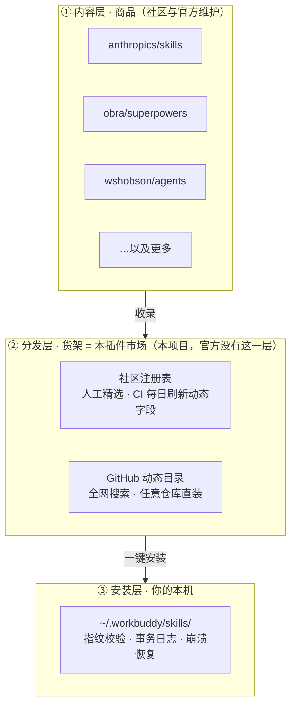
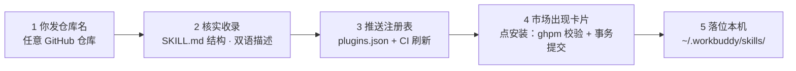

# 常见问题（FAQ）

> 整理自项目作者与使用者的真实问答。看完 README 第一节后还想弄明白「为什么」的，读这里。

---

## 一、社区注册表里的内容是怎么来的？

注册表（`registry/plugins.json`）里每一条都分两类字段：

| 字段类型 | 内容 | 谁在维护 |
| --- | --- | --- |
| 静态字段 | 收录哪个仓库、分类、中英描述、关键词 | 人工审核后提交 |
| 动态字段 | 星数、最后推送日期、最新提交 SHA、刷新时间 | GitHub Actions 每天 21:21 UTC 自动重建，请勿手工编辑 |

所以它**不是一张死名单**：

- 静态收录是刻意的人工把关（质量策略，类似 Homebrew 官方源模式），收录标准见第四节；
- 动态数据每天自动刷新，星数和「还在不在维护」始终是新的；
- **注册表只是「精选推荐位」，不是白名单**——网页的搜索栏走 GitHub 动态目录，任意公开仓库都能搜索并直接安装，不受这 10 几条限制。

想扩充精选区：编辑 `registry/plugins.json` 加一条，提交 PR 即可。市场端按 6 小时 TTL 在线拉取，拉取路线为
`WBM_REGISTRY_URL` 环境变量 → raw.githubusercontent.com → api.github.com → 仓库内本地副本，四级兜底，界面上如实显示数据来源与是否过期。

## 二、这个市场和 anthropics/skills 这类「官方」仓库是什么关系？

一句话：**官方仓库是「商品」，本项目是「货架」，不是竞争关系。**

- `anthropics/skills` 出现在注册表里，是因为它被**收录**了——它是货架上的商品，不是竞品；
- Anthropic 官方只发布技能内容仓库，并没有为 WorkBuddy 做过插件市场，这一层分发基础设施本来就是空白，本项目补的就是它；
- 与同类项目（如 DSH 市场）相比：规模上精选条目还少、社区刚建立，这是差距；可靠性工程是本项目下功夫最深的部分——692 项自检、装卸事务日志与断电恢复、扫描 fail-closed、本地服务按公开入口做安全加固（口令 + Origin 校验 + 白名单）。

## 三、看到一个好仓库想装，怎么操作？（「报菜名」模式）

你只需要给出一个 GitHub 仓库名（例如 `someone/cool-skills`），剩下四步由维护者和系统完成：核实仓库含可用技能 → 写入注册表并推送 → 市场端拉到新条目出现卡片 → 点「安装」落位本机（指纹校验、事务日志，装坏可恢复）。

两条路径按需选择：

- **想快速用**：不用收录，直接在网页搜索栏搜 → 安装，走的是动态目录，任意仓库都行；
- **想留在精选区**：报仓库名给维护者（或提 PR）收录——进精选区意味着全网使用者可见、有中文描述与分类、CI 持续跟踪维护状态。

## 四、收录有门槛吗？

有，三条硬标准，缺一不收：

1. 仓库内含 `SKILL.md` 技能（能被 `ghpm` 直接安装到 `~/.workbuddy/skills/`）；
2. 仓库未归档；
3. 仍在活跃维护。

会剔除的：awesome 列表、平台/框架仓库、纯面试指南等「看起来像技能集合但实际装不了」的仓库。这条门槛是注册表可信度的来源——它不是随便爬来的仓库列表。

## 五、注册表数据多久更新一次？拉不到怎么办？

- 市场端两层缓存：内存 600 秒 + 盘上 6 小时 TTL；界面点「刷新 GitHub 目录」可强制立即拉取；
- CI 每天 21:21 UTC 重建全部条目的星数与最新提交 SHA；
- 四级兜底路线全挂时退回最近一次缓存，界面上**如实**标注来源（`source`）与是否过期（`stale`）——绝不把兜底缓存假装成最新数据。

## 六、安装 / 卸载会不会弄坏我的技能目录？

这是本项目下功夫最深的地方：

- 装 / 卸全程写事务日志，凭证先于任何磁盘动作落盘；断电或崩溃后跑 `python launcher.py --recover`，按内容哈希逐项认领恢复；
- 恢复只认「内容还是当初装进去的那一份」——如果检测到你后来改过，绝不把你的改动洗白成市场版本，冲突会显式保留并提示；
- 卸载先进回收站（可回滚），不直接删；
- 以上行为全部有自检盯防（当前 692 项），回归即失败。

---

还有别的疑问？欢迎[提 issue](https://github.com/zjs105910/workbuddy-market/issues)。
